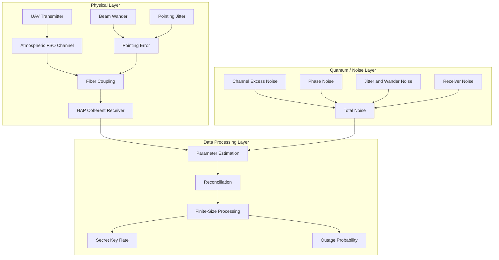

```mermaid
graph TD
  subgraph PHY["Physical Layer"]
    UAV[UAV Transmitter]
    FSO[Atmospheric FSO Channel]
    BW[Beam Wander]
    PJ[Pointing Jitter]
    PE[Pointing Error]
    FC[Fiber Coupling]
    RX[HAP Coherent Receiver]

    UAV --> FSO
    BW --> PE
    PJ --> PE
    FSO --> FC
    PE --> FC
    FC --> RX
  end

  subgraph QN["Quantum / Noise Layer"]
    CN[Channel Excess Noise]
    PN[Phase Noise]
    JN[Jitter and Wander Noise]
    RN[Receiver Noise]
    TN[Total Noise]

    CN --> TN
    PN --> TN
    JN --> TN
    RN --> TN
  end

  subgraph DP["Data Processing Layer"]
    EST[Parameter Estimation]
    REC[Reconciliation]
    FS[Finite-Size Processing]
    SKR[Secret Key Rate]
    OUT[Outage Probability]

    EST --> REC
    REC --> FS
    FS --> SKR
    FS --> OUT
  end

  RX --> EST
  TN --> EST
```
